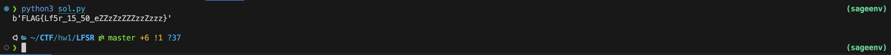
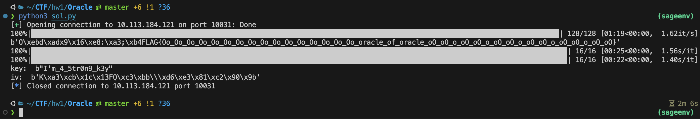
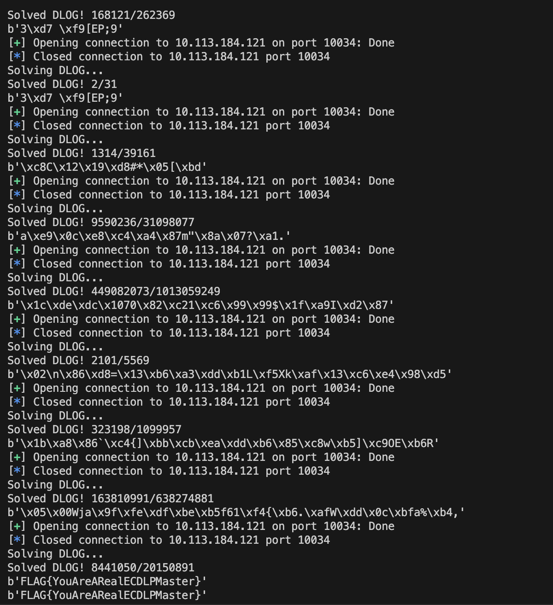
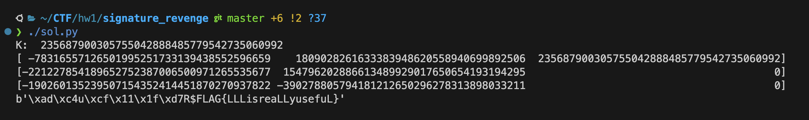
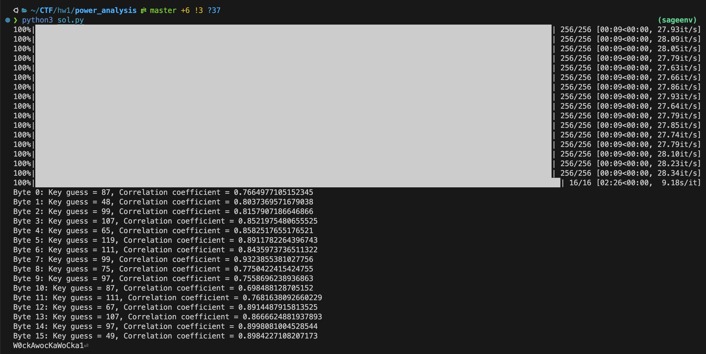

# EDU-CTF HW1 Writeup

學號：`109550157`

## LFSR

Flag：`FLAG{Lf5r_15_50_eZZzZzZZZzzZzzz}`

- 觀察 0: 這題是一個 LFSR，且 LFSR 的 taps 是固定的，所以我們可以利用 Gaussian Elimination 來解出 LFSR 的 key。
- 觀察 1: 雖然我們知道的 bits 是不連續的，但我們可以利用 LFSR 的特性，先構造出矩陣後，得到每一個 bits 線性組合的係數。

以下是我自己實作跟矩陣相關的 function：

```python
def get_matrix(m, n):
    return [[0 for _ in range(n)] for __ in range(m)]


def matrix_mul(A, B):
    p, q, r = len(A), len(B), len(B[0])
    C = get_matrix(p, r)

    for i in range(p):
        for j in range(r):
            for k in range(q):
                C[i][j] ^= A[i][k] & B[k][j]

    return C


def matrix_power(A, p):
    n = len(A)
    I = get_matrix(n, n)

    for i in range(n):
        I[i][i] = 1

    while p:
        if p & 1:
            I = matrix_mul(I, A)
        A = matrix_mul(A, A)
        p >>= 1

    return I


def gaussian_elimination(B):
    N = len(B)

    for i in range(N):
        jj = i
        for j in range(i, N):
            if B[j][i] == 1:
                jj = j
                break

        B[i], B[jj] = B[jj], B[i]

        for j in range(i + 1, N):
            if B[j][i]:
                for k in range(i, N + 1):
                    B[j][k] ^= B[i][k]

    for i in range(N - 1, 0, -1):
        for j in range(i):
            if B[j][i]:
                for k in range(i, N + 1):
                    B[j][k] ^= B[i][k]

    return B
```

根據已知的資訊，我們有的 random bits 數量是 256 + 70 = 326 bits，而前 256 個 bits 是跟 flag XOR 過的結果，無法作為推論用，所以我們只能用後 70 個 bits。
所以我們需要的是原本 LFSR 的第 `70 + 256 * 71`, `70 + 257 * 71`, ... `70 + 325 * 71` 個 bits。

```python
taps = # taps
stream = # stream

N = 64
A = get_matrix(N, N)

# Construct matrix - shift 1 terms
for i in range(63):
    A[i][i + 1] = 1

# Construct matrix - taps terms
for tap in taps:
    A[63][tap] = 1
```

為第 $70 + 256 \cdot 71\,, 70 + 257 \cdot 71\,, \cdots \,, 70 + 325 \cdot 71$ 個 bit 構造線性組合的係數。他們會在 matrix B 的第一列。

```python
A71 = matrix_power(A, 71)
A_b = matrix_power(A, 70 + 256 * 71)

B = get_matrix(N, N)

# Place the linear combination coefficients into matrix B
for i in range(N):
    B[i] = A_b[0]
    A_b = matrix_mul(A_b, A71)

# Construct [B | b]
for i in range(N):
    B[i].append(stream[256 + i])
    B[i].append(i)
```

使用高斯消去法解出 key：

```python
B = gaussian_elimination(B)

key = [0] * N
for i in range(N):
    key[i] = B[i][N]
```

利用 key 來解出 flag：

```python
randomness = LFSR(taps, key)
output = []
for _ in range(len(stream)):
    for __ in range(70):
        randomness.getbit()
    output.append(randomness.getbit())

# Recover the flag  
flag = [0] * 256
for i in range(len(flag)):
    flag[i] = output[i] ^ stream[i]

print(long_to_bytes(int("".join(map(str, flag)), base=2)))
```

以下為取得 flag 的畫面



## Oracle & Oracle_Revenge

Flag (Oracle): `FLAG{Rea11yu5efu110rac1eisntit?}`

Flag (Oracle_Revenge): `FLAG{Oo_Oo_Oo_Oo_Oo_Oo_Oo_Oo_Oo_Oo_Oo_Oo_Oo_Oo_Oo_Oo_oracle_of_oracle_oO_oO_o_oO_oO_o_oO_oO_o_oO_oO_o_oO_oO_o_oO_oO}`

- 觀察 0： 無論是 Oracle 還是 Oracle_Revenge，若我們能 RSA 解密某樣東西 (iv, aes_key, flag, ...)，就能輕鬆解決問題。但 RSA 的資訊並不足以讓我們推得解密的資訊，我們只能好好利用 server 幫我們對傳入的 iv, aes_key 來進行解密，並想辦法把解密後的部分炸出來。
- 觀察 1： server 會根據 padding 的正確與否，回傳不同的訊息。你可以利用這個特性，來實作 Padding Oracle Attack。
- 觀察 2： server 允許我們給定 RSA 加密後的任意 iv 和 aes_key，所以我們可以自己生成 aes_key ，並以 ECB Mode 準備多個單 block 的明文密文對。
- 觀察 3： server 會幫我們用 RSA 解密 aes_key 跟 iv，且 iv 會幫你取最後 16 bytes。在你可以控制單 block 的密文明文的情況下，我們可以將任意被 RSA 加密後的東西傳入 iv，並利用 POA 告知我們 iv 的最後一 byte。
- 觀察 4: 訊息的最後一 byte，其實相當於其整數形式時的 Least Significant Bit (LSB)。我們可以利用這個特性，來實作 LSB Attack。

主要要解的 RSA 包含 encrypted key, encrypted iv, encrypted flag：

```python
encrypted_flag_ = # encrypted flag in Oracle_Revenge
encrypted_key_ =  # encrypted key in Oracle
encrypted_iv_ =   # encrypted iv in Oracle
```

我會隨意生成一個固定的 aes_key，並將它進行 RSA 加密，以作後續使用。
我也另外準備了相關的 AES cipher，以作後續使用。

```python
from secret import aes_key
encrypted_key = asymmetric_encryption(aes_key, N, e)
cipher = AES.new(aes_key, AES.MODE_ECB)
```

以下是一個測試 padding 是否正確，且會和 server 互動的 function。
enc 可以代入我們想要解密的東西，ciphertext 可以代入我們構造的密文。

```python
def test(enc, ciphertext):
    r.recvuntil(b"Give me the encrypted key: ")
    r.sendline(bytes(str(encrypted_key), "utf-8"))

    r.recvuntil(b"Give me the encrypted iv: ")
    r.sendline(bytes(str(enc), "utf-8"))

    r.recvuntil(b"Give me the ciphertext: ")
    r.sendline(bytes(ciphertext.hex(), "utf-8"))

    s = r.recvline().decode()

    if s[0] == "O": # Padding is correct!
        return True
    return False
```

若我們想要知道一個被 RSA 加密後的東西的最後一 byte 是否為 `c`，我們可以利用以下的 function 來進行測試。

```python
def try_c(enc, c):
    m1 = b"\x01" * 15 + bytes([c ^ 1])
    m2 = b"\x02" * 15 + bytes([c ^ 1])
    c1 = cipher.encrypt(m1)
    c2 = cipher.encrypt(m2)
    return test(enc, c1) and test(enc, c2)
```

因為被加密的東西的倒數第二個 bytes 我們還不確定為何，為了避免 padding 為兩個 `0x02` 的狀況，我們對於一個 `c` 會用兩個不同的明文來進行測試，並確保這兩個的明文的倒數第二個 bytes 都不一樣，以確保我們遇到的是結尾為 `0x01` 的狀況。

`interactor` 函式會列舉所有可能並利用 `try_c` 來進行測試，並回傳搜尋到的 byte。

```python
def interactor(enc, _):
    for c in range(256):
        suc = try_c(enc, c)
        if suc:
            return c
    return -1
```

再來便可以利用 `interactor` 來進行 LSB Attack。
`enc` 是待解密的密文；`base` 是我們 least significant bits 的單位；`interactor` 是我們用來和 server 互動的 function；`rounds` 是我們想要解密的輪數。

由於我們是以 `1` bytes 為單位用 POA 得到結果，所以 `base` 會是 256；而 `rounds` 就直接會是我們想解密的東西的長度 (flag: 128 bytes, key, iv: 16 bytes)。

```python
def lsb(n, e, enc, base, interactor, rounds=None):
    if rounds is None:
        rounds = ceil(log(n, base))

    inv = pow(base, -1, n)
    inv_e = pow(base, -e, n)

    rst, tmp, digit = 0, 0, 1

    for _ in tqdm(range(rounds)):
        b = interactor(enc, tmp)

        b = b - tmp % base
        b += base
        b %= base

        rst += b * digit
        rst %= n

        digit = digit * base % n
        tmp = (tmp + b) * inv % n
        enc = enc * inv_e % n

    return rst
```

這邊稍微提到一個優化：
由於 `encrypted_flag` 皆為可視字元，我們可以只利用 `string.printable` 來進行測試，並回傳搜尋到的 byte。

要注意的是，`b - tmp` 才會是可視字元，所以我會將 `tmp` 以 `offset` 參數傳入，並將該 `offset` 加在列舉的可視字元上。

```python
def interactor_flag(enc, offset):
    for c in string.printable:
        c = (ord(c) + offset) % 256
        suc = try_c(enc, c)
        if suc:
            return c
    return -1
```

再來只需要利用 `lsb` 便可以解出 flag、iv、key。
後續只需要利用那個很「強」的 key 跟 iv 來解密 `encrypted_flag.not_png` 即可。

整個解題的主程式如下：

```python
def main():
    rst_flag = lsb(N, e, encrypted_flag_, 256, interactor_flag, 128)
    print(long_to_bytes(rst_flag))

    rst_key = lsb(N, e, encrypted_key_, 256, interactor, 16)
    rst_iv = lsb(N, e, encrypted_iv_, 256, interactor, 16)

    key = long_to_bytes(rst_key)
    iv = long_to_bytes(rst_iv)
    cipher = AES.new(key, AES.MODE_CBC, iv)
    print("key: ", key)
    print("iv: ", iv)

    ct = open("encrypted_flag.not_png", "rb").read()
    pt = unpad(cipher.decrypt(ct))
    open("flag.png", "wb").write(pt)
```

以下為取得 flag(s) 的畫面。



以下為 `flag.png`。


## invalid_curve_attack

Flag：`FLAG{YouAreARealECDLPMaster}`

- 觀察 0: server 在計算 `k * G` 時，不會用到這個橢圓曲線的 `b`，故我們可以隨機產生 `b`，因為大概率能遇到比較 smooth 的 order。
- 觀察 1: 我們可以對 order 質因數分解，並利用 generator 和其中一個質因數 `p` 構造出 order 為該質因數的點。若我們挑的足夠小，在我們橢圓曲線上的 dlog 會很快就能解出來。
- 觀察 2: 上述解出來的 `d` 會是 mod `p` 後的結果，我們可以搜集多組答案並利用中國剩餘定理來解出真正的 `d`。

將我們構造的點傳入 server，並將回傳的點回傳回去的小程式：

```python
def new_data(Gx, Gy):
    r = remote("10.113.184.121", 10034)

    r.sendlineafter(b"Gx: ", Gx)
    r.sendlineafter(b"Gy: ", Gy)
    point = eval(r.recvline().decode())
    r.close()

    return point
```

Random 一個 `b` 並構造出橢圓曲線；順便算出他的 order 並作質因數分解：

```python
def solve_dlog():
    b = randint(1, p - 1)
    E = EllipticCurve(Zmod(p), [a, b])
    order = E.order()
    factors = prime_factors(order)

    valid = []
    for factor in factors:
        if factor < THRESHOLD:
            valid.append(factor)

    prime = valid[-1]
```

使用該質數夠造出 order 為該質數的點，並傳入 server：

```python
    G = E.gen(0) * int(order / prime)
    x, y = map(str, G.xy())

    point = new_data(x.encode(), y.encode())
```

利用 server 回傳的點和我們構造的點，解 dlog：

```python
    try:
        K = E(point[0], point[1])
        print("Solving DLOG...")
        log = discrete_log(K, G, operation="+")
        print("Solved DLOG! {}/{}".format(log, prime))
        return log, prime
    except Exception as e:
        print(e)
        return None, None
```

利用多組 dlog 的結果組回 `d`，並利用 `CRT_list` 解出 flag：

```python
def solve():
    rs = []
    ms = []

    while True:
        dlog, prime = solve_dlog()

        if dlog != None:
            rs.append(dlog)
            ms.append(prime)

            flag = long_to_bytes(CRT_list(rs, ms))
            print(flag)

            if b"FLAG" in flag:
                return flag


if __name__ == "__main__":
    print(solve())

```

以下為取得 flag 的畫面：



## signature_revenge

Flag：`FLAG{LLLisreaLLyusefuL}`

- 觀察 0: 我們可以知道兩個簽名的 `k1`, `k2` 雖然跟模數差不多大，但他們都是由足夠小的 `magic1` 和 `magic2` 線性組合出來的。
- 觀察 1: 只要列好式子，就可以用 LLL algorithm 找到 `magic1`, `magic2`，並解出 `k1`, `k2`。需要特別注意答案可能是 LLL 找出來的向量的線性組合，稍微在附近配個係數加起來試試看即可。

以下為準備一些常數：

```python
h1 = sha256(b"https://www.youtube.com/watch?v=IBnrn2pnPG8").digest()
h2 = sha256(b"https://www.youtube.com/watch?v=1H2cyhWYXrE").digest()
h1, h2 = bytes_to_long(h1), bytes_to_long(h2)

# Calculate t and u
r1, s1 = sig1
r2, s2 = sig2

s1_inv = pow(s1, -1, n)
r2_inv = pow(r2, -1, n)

t = -s1_inv * s2 * r1 * r2_inv
u = s1_inv * r1 * h2 * r2_inv - s1_inv * h1
```

我們知道以下關係式：

- $k_1 = 2^{128} \cdot \text{magic1} + \text{magic2}$

- $k_2 = 2 ^{128} \cdot \text{magic2} + \text{magic1}$

- $k_1 + t \cdot k_2 + u = 0 \pmod n$

- $(2 ^{128} + t) \cdot \text{magic1} + (2 ^{128} \cdot t + 1) \cdot \text{magic2} + u = 0 \pmod n$

- $\text{magic1} + (2^{128} + t)^{-1} \cdot (2 ^{128} \cdot t + 1) \cdot \text{magic2} + (2^{128} + t)^{-1} \cdot u = 0 \pmod n$

```python
two_128 = pow(2, 128, n)
t_128_inv = pow(two_128 + t, -1, n)

t = t_128_inv * (two_128 * t + 1)
u = t_128_inv * u
```

隨機生成一個跟 `magic1`, `magic2` 相近的 `K`，
構造矩陣 `B`，並利用 LLL algorithm 找到最短的向量：

```python
# LLL algorithm to find the shortest vector in lattice basis
while True:
    K = int(2**127 * random.uniform(1, 2))
    B = matrix(ZZ, [[n, 0, 0], [t, 1, 0], [u, 0, K]])
    B = B.LLL()

    # If the shortest vector is the first one, break
    if B[0][2] == K:
        break
```

暴力枚舉線性組合 `B[0]`, `B[1]`, `B[2]` 的係數，用它去得回 `magic1`, `magic2`，並在解出 `k1`, `k2` 後檢查它們是否合法：

```python
# Apply linear combination on B[0], B[1], B[2]
V = 3
is_k1_found = False
for i in range(-V, V):
    for j in range(-V, V):
        new_B = B[0] + i * B[1] + j * B[2]

        magic1, magic2 = -new_B[0], new_B[1]
        k1 = two_128 * magic1 + magic2
        k1 = (k1 % n + n) % n

        if r1 == (k1 * G).x() % n:
            is_k1_found = True
            break

    if is_k1_found:
        break
```

利用 `k1` 組回 `d`。

```python
d = k1 * s1 - h1
d *= pow(r1, -1, n)
d %= n
print(long_to_bytes(d))
```

以下是取得 flag 的畫面：



## Power Analysis

Flag：`CTF{Power_Analysis_is_awesome!}`

讀取 `traces.json`：

```python
with open("traces.json", "r") as f:
    traces = json.load(f)
```

使用 `1` 的 bits 數量作為 power model：

```python
# Define the power model for AES-128
def power_model(pt, key_guess):
    sbox_out = sbox[pt ^ key_guess]
    return sum((sbox_out >> i) & 1 for i in range(8))
```

將 power traces 轉成矩陣：

```python
# Define the number of traces and the number of samples per trace
num_traces = len(traces)
num_samples = len(traces[0]["pm"])

# Initialize the power traces matrix
power_traces = np.zeros((num_traces, num_samples))

# Extract the power traces from the JSON file
for i, trace in enumerate(traces):
    power_traces[i] = np.array(trace["pm"])
```

AES 每個 byte 有 256 種可能，所以我們需要 256 個 key guess 來測試；對於每個可能的 key，我們要紀錄它跟每個 trace 間的 correlation：

```python
# Define the key range to test
key_range = range(256)

# Initialize the correlation matrix
correlation_matrix = np.zeros((256, num_samples))
```

利用以定義好的 power model 來計算 correlation：

```python
# Compute the correlation matrix
for byte_num in tqdm(range(16)):
    for key_guess in tqdm(key_range):
        # Compute the power model for each trace
        power_model_output = np.array(
            [power_model(trace["pt"][byte_num], key_guess) for trace in traces]
        )
        power_model_output = power_model_output.reshape((50, 1)).T

        for t in range(num_samples):
            # Compute the correlation coefficient between the power model output and the power traces
            correlation_coefficient = np.corrcoef(
                power_model_output, power_traces.T[t]
            )[0, 1]
            if correlation_coefficient > correlation_matrix[byte_num, key_guess]:
                # Store the correlation coefficient in the correlation matrix
                correlation_matrix[byte_num, key_guess] = correlation_coefficient
```

找出每個 byte 最高的 correlation coefficient，並將其作為 key：

```python
# Print the key with the highest correlation coefficient for each byte
for byte_num in range(16):
    key_guess = np.argmax(correlation_matrix[byte_num])
    print(
        f"Byte {byte_num}: Key guess = {key_guess}, Correlation coefficient = {correlation_matrix[byte_num, key_guess]}"
    )

key_guesses = [np.argmax(correlation_matrix[byte_num]) for byte_num in range(16)]
# key_guesses = [87, 48, 99, 107, 65, 119, 111, 99, 75, 97, 87, 111, 67, 107, 97, 49]

for i in range(16):
    print(chr(key_guesses[i]), end="")
```

以下是取得 flag 的畫面：


