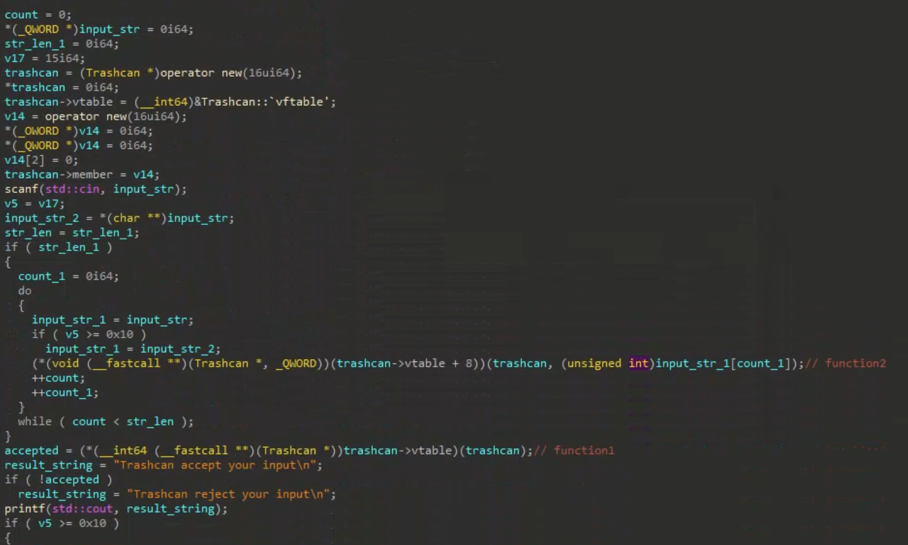
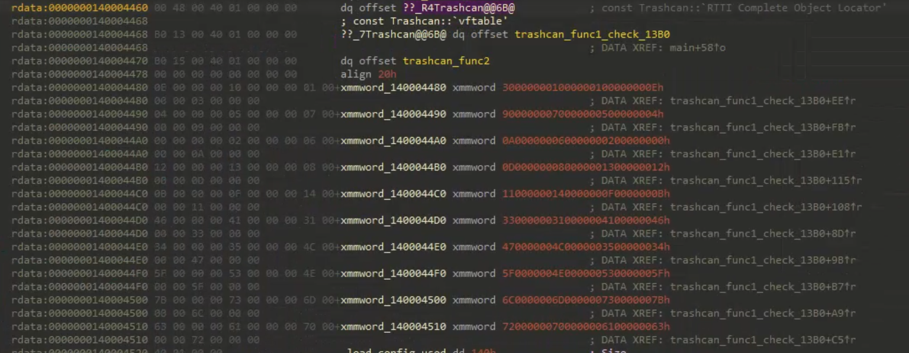
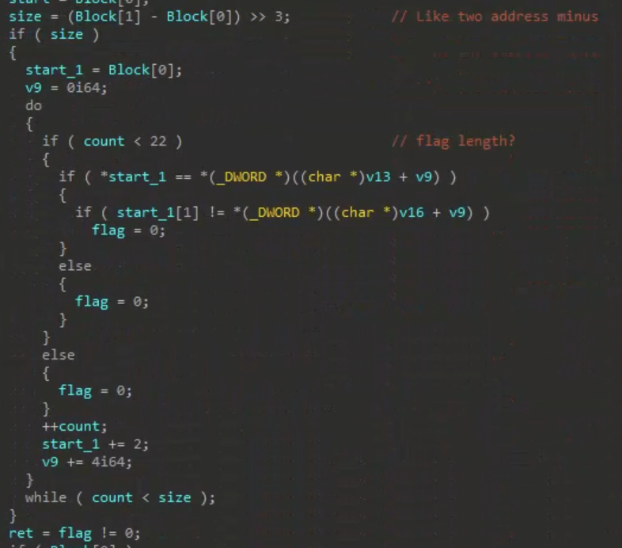
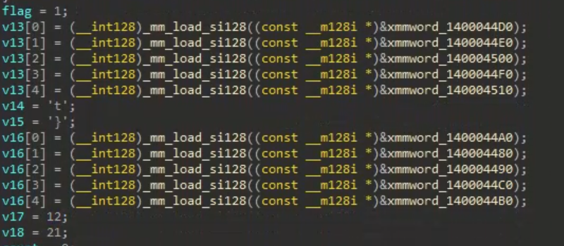
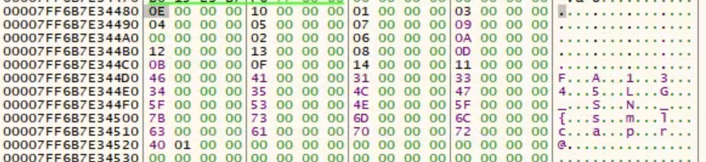
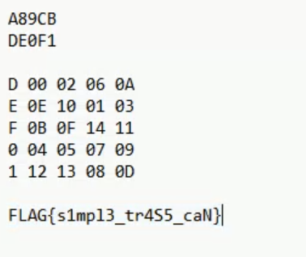

# Trash can

- Flag: `FLAG{s1mpl3_tr4S5_caN}`

首先先看 main 函數，因為還不熟 C++ 的 code，所以先大概根據下面的 result string 來重新命名一些變數跟函數名稱。

主要是看到 `Trashcan::vftable` 的字樣，所以猜測這是一個 class 的位置，所以就先跳去看看這個 class 的定義。

把它的二個 function 大致看過，並且和 main 裡面的呼叫比對，大致猜出第一個 function 是負責做檢查、第二個 function 是負責將我們輸入的資訊統計進去。

我比較好奇 check 裡面的內容，因為可以直接動態看看會不會唬爛到 flag。
靜態看看之後，找到了會拿我們 input 跟某個從 memory 拿東西比較的地方：

